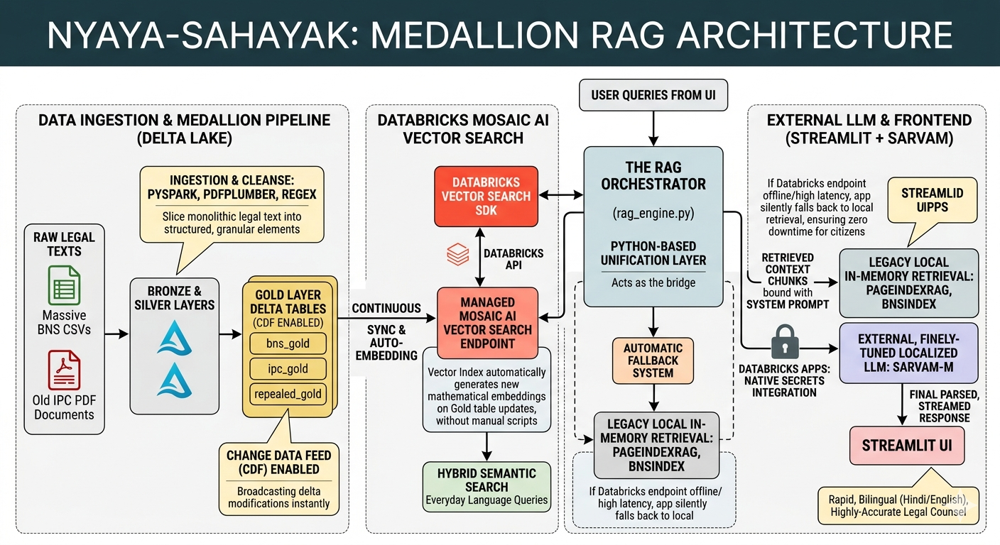
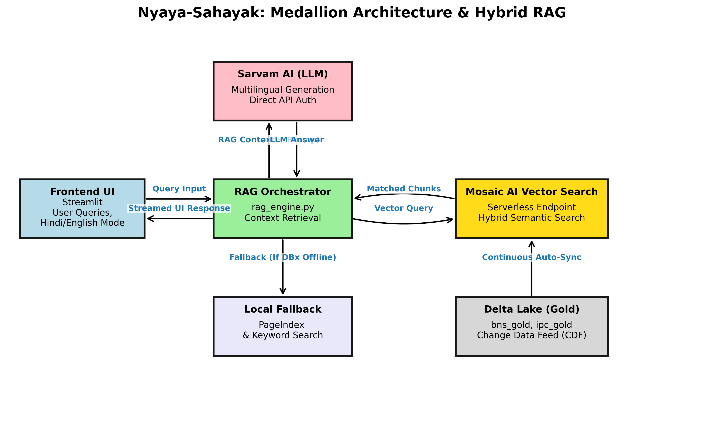

  <h1>⚖️ Nyaya-Sahayak</h1>
  
<strong>Intelligent Legal Assistant for Navigating India's Legal Transition</strong>

  
  
  
  

  
An AI-powered legal application designed to help citizens and professionals navigate the transition from the old <strong>Indian Penal Code (IPC 1860)</strong> to the new <strong>Bharatiya Nyaya Sanhita (BNS 2023)</strong>.

---

## 🌟 Overview

Built on top of a highly scalable *Databricks Medallion Architecture, Nyaya-Sahayak utilizes **Databricks Mosaic AI Vector Search* coupled with localized LLMs (Sarvam AI) for robust, highly accurate Retrieval-Augmented Generation (RAG). It provides context-aware legal explanations, side-by-side scenario comparisons, and instant static section translations.

---

## 🏗️ Architecture

### The Medallion RAG Pipeline
* *Bronze & Silver Layers*: Raw IPC PDFs and BNS CSV datasets are ingested and cleansed into granular components using distributed processing.
* *Gold Layer: Curated Delta Tables (bns_gold, ipc_gold, repealed_gold) ensuring high data reliability with **Change Data Feed (CDF)* enabled.
* *Mosaic AI Vector Search*: Provides continuous synchronization and embedding updates via Databricks Managed Endpoints.
* *RAG Orchestrator: Bridges the Databricks endpoints with a seamless **Local In-Memory Fallback Mechanism* ensuring zero downtime.

#### High-Level Architecture Diagram

#### Component Flow Diagram

---

## ⚙️ Databricks Tech Utilized

*1. 🌊 Databricks Delta Lakes*
We utilized Delta Lakes to structure our legal corpus into *Bronze, Silver, and Gold layers*. Delta Lake provides ACID transactions and scalable metadata handling. This Medallion architecture ensures that raw legal documents (Bronze) are progressively cleansed and chunked (Silver) before being organized into highly optimized, ML-ready tables (Gold) that our vector databases query against.

*2. ⚡ PySpark*
We used PySpark across our data ingestion pipelines to handle the distributed data processing. It efficiently reads and transforms heavy, unstructured IPC PDFs and BNS CSV datasets, applying complex regex and text standardizations to produce the clean semantic chunks necessary for an enterprise-level RAG system.

*3. 🔍 Mosaic AI Vector Search Endpoint*
We leveraged Databricks Mosaic Vector Search to manage our embeddings. By pointing the managed endpoints directly at our Gold Delta Tables (using Change Data Feed), our vector embeddings automatically synchronize whenever underlying laws change. This guarantees absolute highest accuracy in our RAG workflow with millisecond retrieval and no manual vector database maintenance.

*4. ☁️ Deployed natively on Databricks Apps*
We deployed the frontend seamlessly via *Databricks Apps*. Databricks manages the underlying compute automatically, eliminating the need to expose ports securely and handling Secrets vault injection seamlessly without .env files. 
* *How to configure:* Navigate to *Compute* -> *Apps* -> *Create App* in your workspace, link this GitHub repository (or upload Workspace files), and Databricks launches the app directly on serverless infrastructure!

---

## ⚙️ Deployed App Links
Databricks Deployed App Link -> https://nayaya-sahita-7474652331921818.aws.databricksapps.com/

Fallback Streamlit Deployed App Link -> https://nayay-sahinta-databricks-kb7ijl7djggdtn5dnr66dz.streamlit.app/

---

## ⚙️ App Usage Video Link
Google Drive Link -> https://drive.google.com/file/d/1fbFcI0ha44JlQqHktGiAL_S32zpHyIuw/view

Youtube Link -> https://youtu.be/W8Q8LSjpQWE

---

## 🚀 How to Run & Deploy

### Option 1: Run Locally (Development)

*1. Clone the repository and install dependencies:*
bash
git clone https://github.com/IamSaransh/nayay-sahinta-databricks.git
cd nayay-sahinta-databricks
conda create -n databrics python=3.10 -y
conda activate databrics
pip install -r requirements_dbx.txt
pip install databricks-vectorsearch

*2. Configure Secrets:*
Create a .env file containing your configurations:
env
DATABRICKS_HOST=https://your-workspace.cloud.databricks.com
DATABRICKS_TOKEN=your_token_here
SARVAM_API_KEY=your_sarvam_api_key

*3. Run the Streamlit Application:*
bash
streamlit run app.py

### Option 2: Deploy to Databricks Apps (Production)

This app is natively optimized to be deployed as a *Databricks App*. Databricks automatically handles the workspace tokens so you do not need an .env file!

*1. Store your LLM API key securely in Databricks Secrets:*
Using the Databricks CLI:
bash
databricks secrets create-scope nyaya_secrets
databricks secrets put-secret nyaya_secrets sarvam_api_key

*2. Deploy via Workspace UI:*
* Navigate to your Databricks Workspace UI.
* Go to *Compute* -> *Apps* -> *Create App*.
* Select this GitHub repository as your source (Ensure it is tracked, or select *Workspace* and drag the file contents).
* Databricks seamlessly reads the included app.yaml, safely injects the token from the nyaya_secrets vault, auto-applies cluster configurations, and boots the Streamlit application!

 

  <em>Enjoy super-fast, semantic legal retrieval on enterprise-grade infrastructure! 🚀</em>

# mayank_modified
